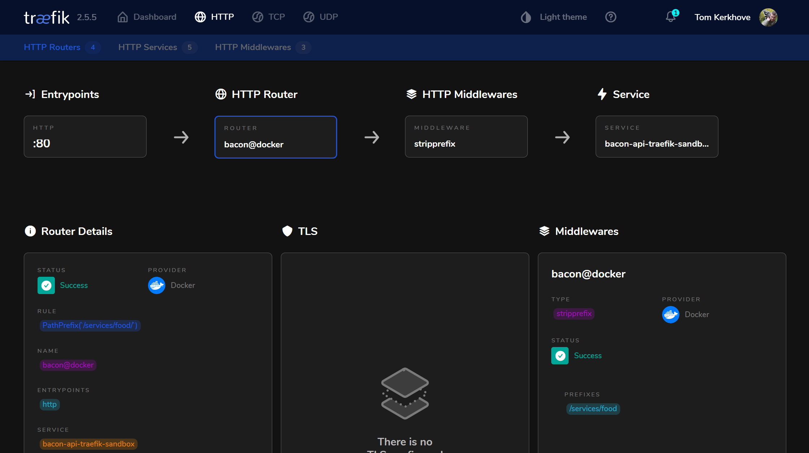

# Traefik Playground 🤹‍♂️

Sandbox to play with Traefik as a reverse proxy to expose services 🤹‍♂️

## Running it locally

Start the Docker containers:

```bash
$ docker-compose up
Creating network "traefik-sandbox_default" with the default driver
Creating traefik-sandbox_reverse-proxy_1 ... done
Creating traefik-sandbox_bacon-api_1     ... done
Attaching to traefik-sandbox_bacon-api_1, traefik-sandbox_reverse-proxy_1
reverse-proxy_1  | time="2021-12-19T13:07:18Z" level=info msg="Configuration loaded from flags."
bacon-api_1      | warn: Microsoft.AspNetCore.DataProtection.KeyManagement.XmlKeyManager[35]
bacon-api_1      |       No XML encryptor configured. Key {055a6456-f920-428f-9c8f-f48dfd2ba794} may be persisted to storage in unencrypted form.
bacon-api_1      | Hosting environment: Production
bacon-api_1      | Content root path: /app
bacon-api_1      | Now listening on: http://[::]:80
bacon-api_1      | Application started. Press Ctrl+C to shut down.
```

### Get bacon

```bash
$ curl -i http://127.0.0.1:88/services/food/api/v1/bacon
HTTP/1.1 200 OK
Content-Type: application/json; charset=utf-8
Date: Sun, 19 Dec 2021 13:02:22 GMT
Server: Kestrel
Transfer-Encoding: chunked

["Slab Bacon","Canadian Bacon","Smoked Bacon"]
```

### Manage

Optionally, you can use the Traefik portal to explore the setup:
1. Go to http://localhost:89
2. Select "HTTP" > "HTTP Routers" > "bacon@docker"
3. View the details

